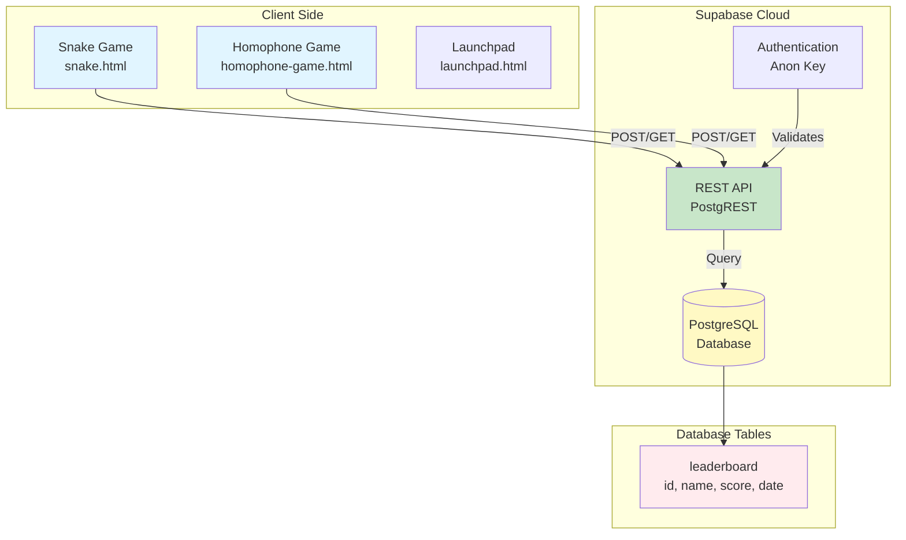
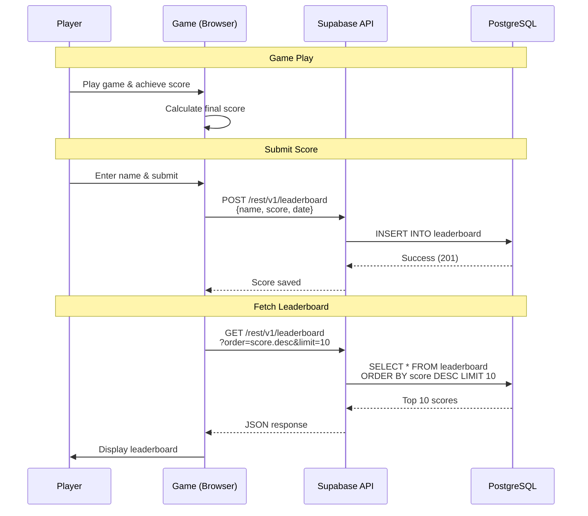
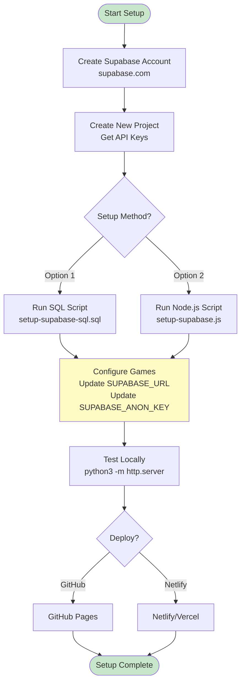
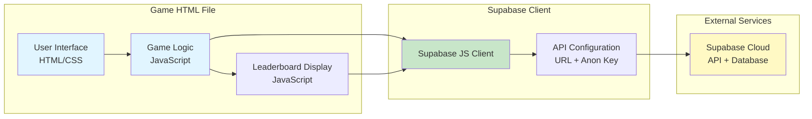

# General Technology - AI Assistant Documentation

**Purpose:** Documentation for the General Technology project - web games with Supabase leaderboards.

**Last Updated:** 2025-01-27

---

## Overview

The General Technology project contains web-based games with persistent leaderboards powered by Supabase. The project includes:

- **Snake Game** - Classic snake game with online leaderboard
- **Homophone Game** - Word game with leaderboard tracking
- **Launchpad** - Project landing page

All games use Supabase for backend data storage and real-time leaderboard updates.

---

## Project Structure

```
generaltechnology/
├── index.html              # Main landing page
├── snake.html              # Snake game
├── homophone-game.html     # Homophone game
├── launchpad.html          # Launchpad page
├── README.md               # Project overview
├── AUTO_SETUP.md           # Quick setup guide
├── SUPABASE_SETUP.md       # Detailed Supabase setup
├── setup-supabase-sql.sql  # SQL setup script
├── setup-supabase.js       # Node.js setup script
└── *.sql                   # Database setup scripts
```

---

## Key Components

| Component | Purpose | Location |
|-----------|---------|----------|
| Snake Game | Classic snake game with leaderboard | `snake.html` |
| Homophone Game | Word game with leaderboard | `homophone-game.html` |
| Launchpad | Project landing page | `launchpad.html` |
| Supabase Backend | Database and API for leaderboards | Supabase Cloud |
| Setup Scripts | Automated database setup | `setup-*.sql`, `setup-*.js` |

---

## Architecture

### System Architecture

The project uses a client-server architecture:

1. **Frontend**: HTML/CSS/JavaScript games running in the browser
2. **Backend**: Supabase (PostgreSQL database + REST API)
3. **Data Flow**: Games → Supabase API → PostgreSQL → Leaderboard display



### Leaderboard Flow

1. Player completes game and submits score
2. Game sends POST request to Supabase API
3. Supabase stores score in `leaderboard` table
4. Game fetches top scores via GET request
5. Leaderboard displays in real-time



### Setup Workflow



### Game Component Architecture



---

## Setup & Configuration

### Prerequisites

- Supabase account (free tier available)
- Web server (GitHub Pages, Netlify, or local server)

### Quick Setup

1. **Create Supabase Project**
   - Go to https://supabase.com/
   - Create new project
   - Get API keys (URL and anon key)

2. **Run Database Setup**
   ```bash
   # Option 1: SQL Script (Recommended)
   # Copy setup-supabase-sql.sql to Supabase SQL Editor and run
   
   # Option 2: Node.js Script
   SUPABASE_SERVICE_KEY=your_key node setup-supabase.js
   ```

3. **Configure Games**
   - Update `SUPABASE_URL` in game HTML files
   - Update `SUPABASE_ANON_KEY` in game HTML files

4. **Deploy**
   - Push to GitHub and enable Pages
   - Or deploy to Netlify/Vercel

### Database Schema

**leaderboard table:**
- `id` (uuid, primary key)
- `name` (text) - Player name
- `score` (int8) - Game score
- `date` (text) - Date string
- `created_at` (timestamp) - Auto-generated

---

## Games

### Snake Game

**File:** `snake.html`

**Features:**
- Classic snake gameplay
- Online leaderboard
- Score persistence
- Real-time top scores display

**Configuration:**
```javascript
const SUPABASE_URL = 'https://xxxxx.supabase.co';
const SUPABASE_ANON_KEY = 'your-anon-key';
```

### Homophone Game

**File:** `homophone-game.html`

**Features:**
- Word matching game
- Leaderboard tracking
- Score persistence

**Configuration:**
Same Supabase configuration as Snake game.

---

## Supabase Configuration

### API Keys

- **Project URL**: Found in Settings → API
- **anon public key**: Safe for client-side use
- **service_role key**: Server-side only (never expose!)

### Row Level Security (RLS)

For simplicity, RLS can be disabled for leaderboard table:
- Allows public read/write access
- Suitable for game leaderboards
- Can be secured later with policies if needed

### Free Tier Limits

- 500 MB database storage
- 2 GB bandwidth/month
- More than enough for game leaderboards

---

## Development

### Local Development

1. **Start local server:**
   ```bash
   # Python
   python3 -m http.server 8000
   
   # Node.js
   npx http-server
   ```

2. **Open in browser:**
   ```
   http://localhost:8000/snake.html
   ```

### Testing

1. Play game and submit score
2. Check Supabase Table Editor for new entry
3. Verify leaderboard updates in real-time
4. Test with multiple browsers/devices

---

## Troubleshooting

### Common Issues

**Issue: Scores not saving**
- Check Supabase API keys are correct
- Verify database table exists
- Check browser console for errors
- Verify RLS is disabled or policy allows writes

**Issue: Leaderboard not loading**
- Check network tab for API calls
- Verify Supabase URL is correct
- Check CORS settings in Supabase
- Verify table has data

**Issue: GitHub secret scanning**
- Anon key is safe to expose (designed for client-side)
- If flagged, it's a false positive
- Can safely allow in GitHub settings

---

## Deployment

### GitHub Pages

1. Push code to GitHub repository
2. Go to Settings → Pages
3. Select branch (usually `main`)
4. Site will be available at `username.github.io/repo-name`

### Netlify/Vercel

1. Connect GitHub repository
2. Configure build settings (no build needed for static files)
3. Deploy automatically on push

---

## Documentation Management

**CRITICAL: Git is the source of truth for all documentation. All documentation changes MUST be committed to git.**

### Documentation Workflow
1. **Git is the source of truth** - All documentation lives in git repository
2. **Always commit documentation changes** - Never leave documentation changes uncommitted
3. **Update both documentation files** when making changes:
   - Update `AI_DOCUMENTATION.md` (Markdown)
   - Update `AI_DOCUMENTATION_CONFLUENCE.md` (Confluence markup)
4. **Confluence sync** - Confluence should be updated from git files (not the other way around)

### Documentation Files (All tracked in git)
- `AI_DOCUMENTATION.md` - Main documentation (Markdown format)
- `AI_DOCUMENTATION_CONFLUENCE.md` - Confluence-ready documentation (Confluence markup)
- `README.md` - Project overview
- `AUTO_SETUP.md` - Quick setup guide
- `SUPABASE_SETUP.md` - Detailed Supabase configuration

### Documentation Commit Rules
- **NEVER** leave documentation changes uncommitted
- Documentation changes should be committed in the same commit as code changes, or immediately after
- If updating documentation separately, commit it as a separate commit: "Update documentation for feature X"
- All documentation files are tracked in git and must be committed

---

## Version Management

**CRITICAL: Always update version numbers when making changes to HTML files with version numbers.**

### Version Format
- Use semantic versioning: `vMAJOR.MINOR.PATCH` (e.g., v1.0.1)
- For frequent updates, increment the PATCH version (third number)
- Example progression: v1.0.1 → v1.0.2 → v1.0.3

### When to Update
- **ALWAYS** update the version number when:
  - Adding new features
  - Fixing bugs
  - Making UI/UX changes
  - Updating game logic
  - Any code changes to files with version numbers

### How to Update
1. Find the version element in the HTML file (usually `<div id="version">vX.X.X</div>`)
2. Increment the patch version (third number)
3. Commit the version update in the same commit as the changes, or as a separate commit immediately after

### Files with Version Numbers
- `unit-tests.html` - Contains version display at bottom of page

---

## Related Documentation

- `AUTO_SETUP.md` - Quick setup guide
- `SUPABASE_SETUP.md` - Detailed Supabase configuration
- `README.md` - Project overview
- `.cursorrules` - Cursor IDE rules and guidelines

---

**Last Updated:** 2025-01-27  
**Maintained By:** Xavier
