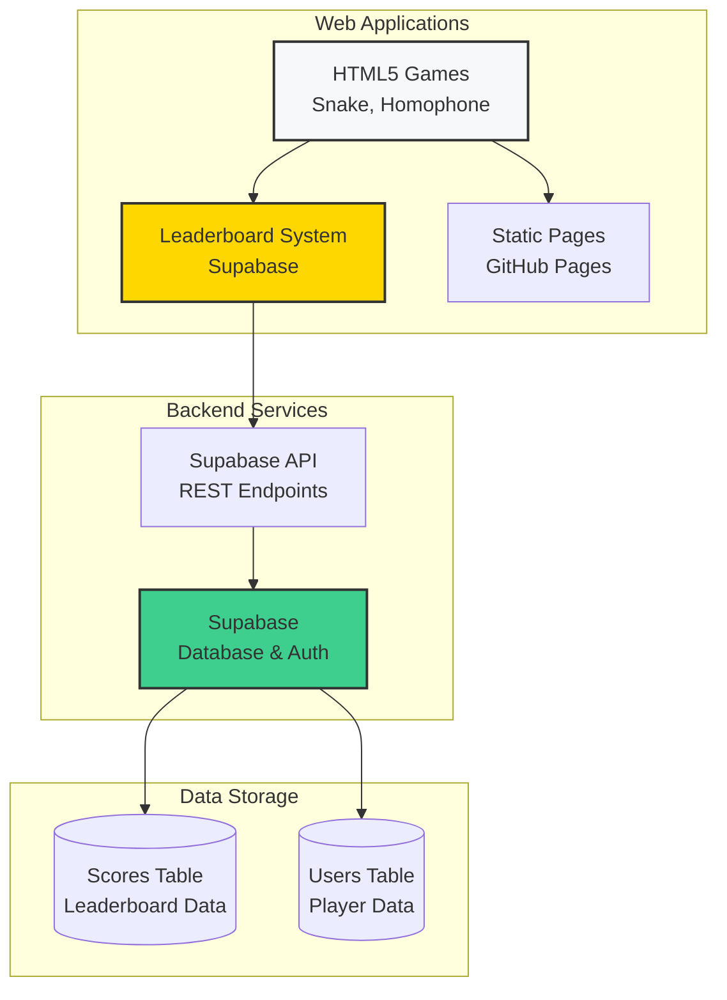

# General Technology - Web Projects & Games

**Last Updated:** 2025-12-28  
**Status:** ✅ Active  
**Purpose:** Web-based games, leaderboards, and interactive applications hosted on GitHub Pages

## Diagrams (Mermaid)

This README includes diagrams written in **Mermaid** using fenced blocks like ` ```mermaid `.

- **GitHub**: Mermaid diagrams should render inline.
- **GitLab**: Mermaid rendering depends on instance configuration. If you see `flowchart LR` / `sequenceDiagram` as plain text, Mermaid is likely disabled—use the *raw* view or enable Mermaid for the instance.

## Table of contents

- [Concept of Operations (CONOPS)](#concept-of-operations-conops)
- [Quick Start](#quick-start)
- [Configuration](#configuration)
- [Operations](#operations)
- [Projects](#projects)
- [Documentation](#documentation)
- [Status](#status)

---

## Concept of Operations (CONOPS)

### Overview

General Technology hosts multiple web-based projects:
- **Interactive Games:** HTML5 games with leaderboards
- **Leaderboard System:** Supabase-backed scoring and rankings
- **Homophone Game:** Word game with accuracy tracking
- **Snake Game:** Classic snake game implementation
- **Static Hosting:** GitHub Pages deployment

### System Architecture



### Key Components

1. **Web Games**
   - HTML5/CSS/JavaScript implementations
   - Client-side game logic
   - Real-time scoring
   - Responsive design

2. **Leaderboard System**
   - Supabase database integration
   - Score tracking and rankings
   - User authentication (optional)
   - Real-time updates

3. **Hosting**
   - GitHub Pages for static hosting
   - Custom domain support (CNAME)
   - Automatic deployments

4. **Database (Supabase)**
   - PostgreSQL database
   - REST API access
   - Real-time subscriptions
   - Row-level security

### Data Flow

```
1. User → Game (plays game)
2. Game → Score Calculation (calculates score)
3. Game → Supabase API (submits score)
4. Supabase → Database (stores score)
5. Leaderboard → Supabase API (fetches rankings)
6. Leaderboard → Display (shows top scores)
```

---

## Quick Start

### Prerequisites

- Web browser (modern browser required)
- Supabase account (for leaderboard features)
- GitHub account (for hosting)

### Local Development

1. **Clone Repository**
   ```bash
   git clone <repository-url>
   cd general.technology
   ```

2. **Set Up Supabase** (if using leaderboards)
   - Create Supabase project
   - Run SQL setup scripts
   - Configure API keys

3. **Open in Browser**
   ```bash
   open index.html
   # or
   python3 -m http.server 8000
   ```

### Deployment

1. **GitHub Pages**
   - Push to GitHub repository
   - Enable GitHub Pages in settings
   - Configure custom domain (if needed)

2. **Supabase Setup**
   - Run `setup-supabase-sql.sql`
   - Configure environment variables
   - Test API connections

---

## Configuration

### Supabase Configuration

- **Database:** PostgreSQL
- **Tables:** Scores, users, leaderboards
- **API:** REST API endpoints
- **Auth:** Optional authentication

### Game Configuration

- **Snake Game:** Configurable speed, grid size
- **Homophone Game:** Word lists, difficulty levels
- **Leaderboards:** Score limits, ranking algorithms

### Hosting

- **GitHub Pages:** Static file hosting
- **Custom Domain:** CNAME configuration
- **HTTPS:** Automatic via GitHub Pages

---

## Operations

### Daily Operations

1. **Monitor Games**
   - Check game functionality
   - Review leaderboard submissions
   - Monitor error logs

2. **Maintain Database**
   - Review score submissions
   - Clean up old data if needed
   - Backup database periodically

3. **Update Content**
   - Add new games
   - Update leaderboards
   - Fix bugs and improvements

### Backup & Recovery

- **Code:** Version controlled in Git
- **Database:** Supabase automatic backups
- **Configuration:** Documented in repository

### Troubleshooting

- **Games not loading:** Check browser console for errors
- **Leaderboard issues:** Verify Supabase connection
- **API errors:** Check Supabase project status
- **Hosting issues:** Verify GitHub Pages configuration

---

## Projects

### Active Games

- **Snake Game:** Classic snake game with leaderboard
- **Homophone Game:** Word matching game with accuracy tracking
- **Blank Game:** Template for new games

### Leaderboard Features

- Real-time score updates
- Top scores display
- Player rankings
- Accuracy tracking (for homophone game)

---

## Documentation

- **[SUPABASE_SETUP.md](docs/SUPABASE_SETUP.md)** - Supabase configuration guide
- **[AUTO_SETUP.md](docs/AUTO_SETUP.md)** - Automated setup instructions
- SQL scripts for database setup

---

## Status

✅ **Active** - Games functional and hosted

**Last Verified:** 2025-12-28